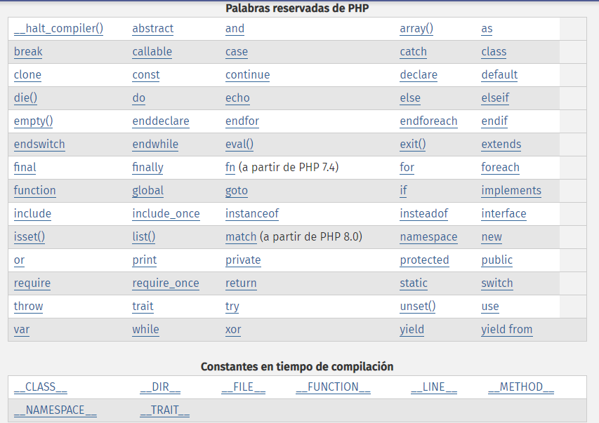

# TRABAJO PHP 
# FUNDAMENTOS DE PROGRAMACIÓN 
# CURSO CLOUD COMPUTING 
## Antonio Daza Dueñas Cynthia Martín Martínez
## Historia
PHP tal y como se conoce hoy en día es en realidad el sucesor de un producto llamado PHP/FI. Creado en 1994 por Rasmus Lerdorf, la primera encarnación de PHP era un conjunto simple de ficheros binarios Common Gateway Interface (CGI) escritos en el lenguaje de programación C. Originalmente utilizado para rastrear visitas de su currículum online, llamó al conjunto de scripts "Personal Home Page Tools", más frecuentemente referenciado como "PHP Tools". Con el paso del tiempo se quiso más funcionalidad, y Rasmus reescribió PHP Tools, produciendo una implementación más grande y rica. Este nuevo modelo fue capaz de interaccionar con bases de datos, y mucho más, proporcionando un entorno de trabajo sobre cuyos usuarios podían desarrollar aplicaciones web dinámicas sencillas tales como libros de visitas. En junio de 1995, Rasmus » publicó el código fuente de PHP Tools, lo que permitió a los desarrolladores usarlo como considerasen apropiado. Esto también permitió -y animó- a los usuarios a proporcionar soluciones a los errores del código, y generalmente a mejorarlo.

En septiembre de ese mismo año, Rasmus amplió PHP y -por un corto periodo de tiempo- abandonó el nombre de PHP. Ahora, refiriéndose a las herramientas como FI (abreviatura de "Forms Interpreter"), la nueva implementación incluía algunas de las funciones básicas de PHP tal y como la conocemos hoy. Tenía variables como las de Perl, interpretación automática de variables de formulario y sintaxis incrustada HTML. La sintaxis por sí misma era similar a la de Perl, aunque mucho más limitada, simple y algo inconsistente. De hecho, para embeber el código en un fichero HTML, los desarrolladores tenían que usar comentarios de HTML. Aunque este método no era completamente bien recibido, FI continuó gozando de expansión y aceptación como una herramienta CGI --- pero todavía no completamente como lenguaje. Sin embargo, esto comenzó a cambiar al mes siguiente; en octubre de 1995 Rasmus publicó una versión nueva del código. Recordando el nombre PHP, ahora era llamado (resumidamente) "Personal Home Page Construction Kit," y fue la primera versión que presumía de ser, en aquel momento, considerada como una interfaz de scripts avanzada. El lenguaje fue deliberadamente diseñado para asemejarse a C en estructura, haciéndolo una adopción sencilla para desarrolladores familiarizados con C, Perl, y lenguajes similares. Habiendo sido así bastante limitado a sistemas UNIX y compatibles con POSIX, el potencial para una implementación de Windows NT estaba siendo explorada.

El código fue completamente rehecho de nuevo, y en abril de 1996, combinando los nombres de versiones anteriores, Rasmus introdujo PHP/FI. Esta implementación de segunda generación comenzó realmente a desarrollar PHP desde un conjunto de herramientas dentro de un lenguaje de programación de derecho propio. Incluía soporte interno para DBM, mSQL, y bases de datos Postgres95, cookies, soporte para funciones definidas por el usuario, y mucho más. Ese mes de junio, PHP/FI brindó una versión 2.0. Sin embargo, un interesante hecho sobre esto, es que sólo había una única versión completa de PHP 2.0. Cuando finalmente pasó de la versión beta en noviembre de 1997, el motor de análisis subyacente ya estaba siendo reescrito por completo.

Aunque vivió una corta vida de desarrollo, continuó gozando de un crecimiento de popularidad en el aún joven mundo del desarrollo. En 1997 y 1998, PHP/FI tenía un culto de varios miles de usuarios en todo el mundo. Una encuesta de Netcraft en mayo de 1998 indicó que cerca de 60,000 dominios reportaron que tenían cabeceras que contenían "PHP", indicando en efecto que el servidor host lo tenía instalado. Este número se correspondía con aproximadamente el 1% de todos los dominios de Internet del momento. A pesar de estas impresionantes cifras, la maduración de PHP/FI estaba condenada por limitaciones; mientras habían varios contribuidores menores, aún era desarrollado principalmente por un individuo.

PHP ha pasado por diferentes versiones:
1. PHP 3 
```
PHP 3.0 fue la primera versión que más se parecía al PHP que existe hoy. Encontrando todavía PHP/FI 2.0 ineficiente y falto de las características que necesitaban para impulsar una aplicación de comercio electrónico que estaban desarrollando para un proyecto de universidad, Andi Gutmans y Zeev Suraski, de Tel Aviv, Israel, comenzaron otra nueva versión del analizador subyacente en 1997.
```
2. PHP 4
```
En el invierno de 1998, poco después del lanzamiento oficial de PHP 3.0, Andi Gutmans y Zeev Suraski comenzaron a trabajar en una nueva versión del núcleo de PHP. Los objetivos de diseño fueron mejorar la ejecución de aplicaciones complejas y mejorar la modularidad del código base de PHP.
```
3. PHP 5
```
PHP 5 fué lanzado en Julio del 2004 después de un largo desarrollo y varios pre-releases. Está básicamente impulsado por su núcleo, Zend Engine 2.0 que contiene un nuevo modelo de objectos y docenas de nuevas opciones.
```

## Lenguaje Interpretado
Un lenguaje interpretado es un lenguaje de programación para el que la mayoría de sus implementaciones ejecuta las instrucciones directamente, sin una previa compilación del programa a instrucciones en lenguaje máquina. El intérprete ejecuta el programa directamente, traduciendo cada sentencia en una secuencia de una o más subrutinas ya compiladas en código máquina.

## Palabras Clave
A continuación se mostrarán las palabras clave utilizadas en PHP sin extensión de librerías.


## Sensible a mayúsuclas y minúsculas
PHP np es sensible a mayúsculas y minúsculas.

## Fuertemente tipado o no
La mayoría de veces, el tipado débil es en donde no indicamos el tipo de variable al declararla. La verdadera diferencia es que podemos asignar, por ejemplo, un valor entero a una variable que anteriormente tenía una cadena.
También podemos operar aritméticamente con variables de distintos tipos.

* Ventajas
    1. Nos olvidamos de declarar el tipo.
    2. Podemos cambiar el tipo de la variable sobre la marcha. Por ejemplo, asignarle un string a un int.
    3. Escribimos menos código.

* Desventajas
    1. Al hacer operaciones, a veces éstas salen mal. Por ejemplo, puede que intentemos sumar 500 + “400.00” + 10, cosa que será errónea.
    2. Especialmente en Javascript, he notado que hay errores al comparar números que creemos que son números, pero no lo son. Por ejemplo, algo como “20” > “100” dará como resultado true, ya que son comparados como cadena, no como números.
    3. Hay que castear muchas veces. En ocasiones, tendremos que castear forzosamente las variables para que se comporten como queremos y no generen errores como los mencionados arriba.
    4. Código menos expresivo. Al declarar los argumentos de una función no sabemos si ésta espera un flotante, un entero, un string, etcétera. Tenemos que ir a la función, ver lo que hace e inferir el tipo de variable que espera.
    5. Inseguridad: existe la posibilidad de que un atacante descubra una vulnerabilidad en donde nosotros esperemos una variable de determinado tipo pero se reciba otra.

    ## Remuneración
    El salario desarrollador php promedio en España es de € 27.500 al año o € 14,10 por hora. Los cargos de nivel inicial comienzan con un ingreso de € 24.000 al año, mientras que profesionales más experimentados perciben hasta € 35.625 al año.

    ## Comunidad
    PHP es un lenguaje tan extendido que hay una amplia comunidad de desarrolladores en todas partes del mundo. 
    La página [php central](https://www.phpcentral.com/) es un ejemplo de comunidad hispanohablante del lenguaje PHP.

    ## Influencia de otro lenguaje
    PHP surgió en 1995 como un lenguaje de programación que poco a poco iría creciendo y que partiría de la base y de la influencia de otros como C, C++, Java e incluso Perl o Tcl.

    ## Multiplataforma 
    PHP es multiplataforma y por lo tanto responsive, te permite operar en varios sistemas operativos. Funciona excelente en LINUX, UNIX y Windows. También funciona sin esfuerzos con Apache/MySQL. 
    
